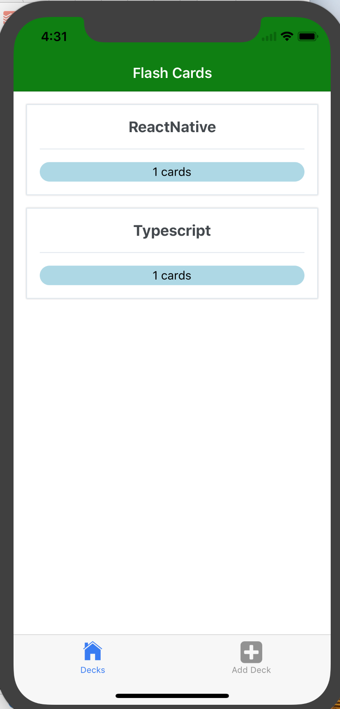
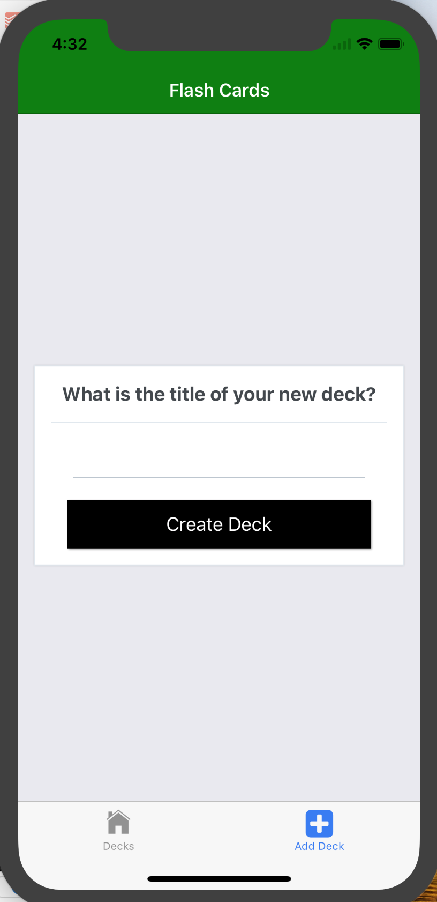
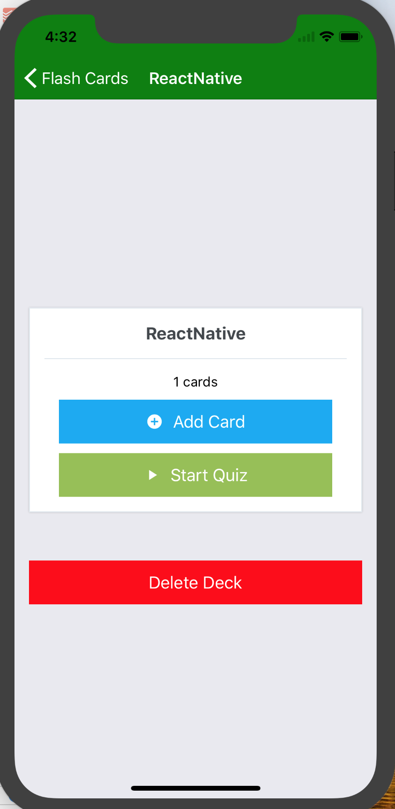
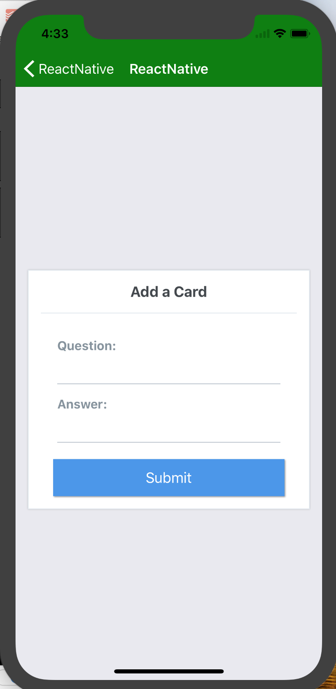
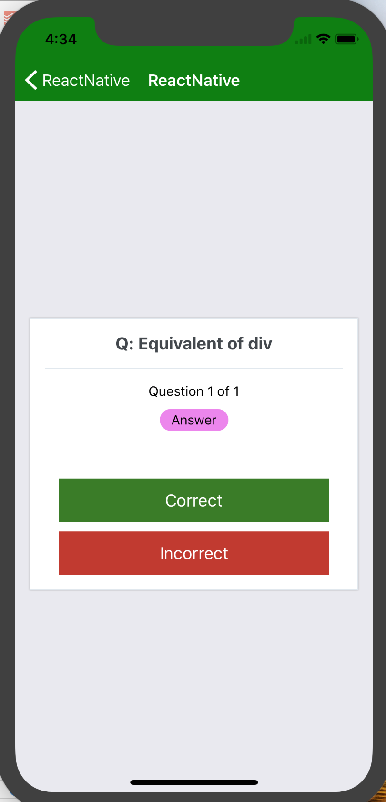

# Udacity React Nanodegree Project 3
A cross platform mobile Flashcard App

Allows users to study collections of flashcards. The app will allow users to create different categories of flashcards called "decks", add flashcards to those decks, then take quizzes on those decks.

## Why this project?

From Udacity Project Details:

"This project encompasses the fundamental aspects of building a native application including handling infinite lists, routing, and user input."


## How to Load the App
This project was bootstrapped with [Create React Native App](https://github.com/react-community/create-react-native-app) and uses the Yarn package manager.

You can find directions for installing Yarn here: [Yarn Installation](https://yarnpkg.com/en/docs/install)

Once Yarn is installed, open up your command shell and navigate to the directory where you want to store the app and run
```
git clone git@github.com:npatta01/reactnd-project-flashcards.git
yarn 
```

You can view the project through an emulator like [Genymotion](https://www.genymotion.com/) or directly through your android or iPhone by connecting the mobile phone to using the Expo app.

When the app has loaded a QRcode will appear in the shell window.  Press `a` to open the app with the emulator or connected device -- or -- scan the QR code in the Expo app.

If you have difficulty connecting to the app you can use the [Expo XDE](https://expo.io/tools) to connect your device.  

## Platform
App was tested on an android device and ios simulator


## Screenshots

**Home Screen**


**Add deck screen**


**Deck Detail Screen**


**Add Card Screen**


**Active Quiz Screen**



